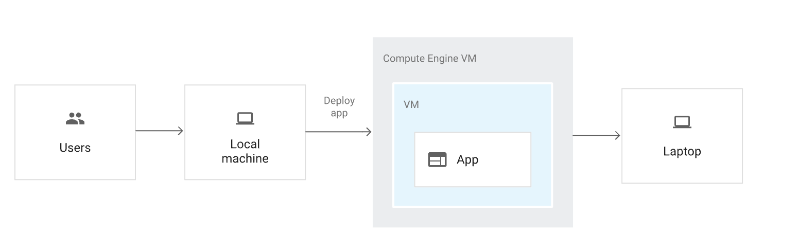
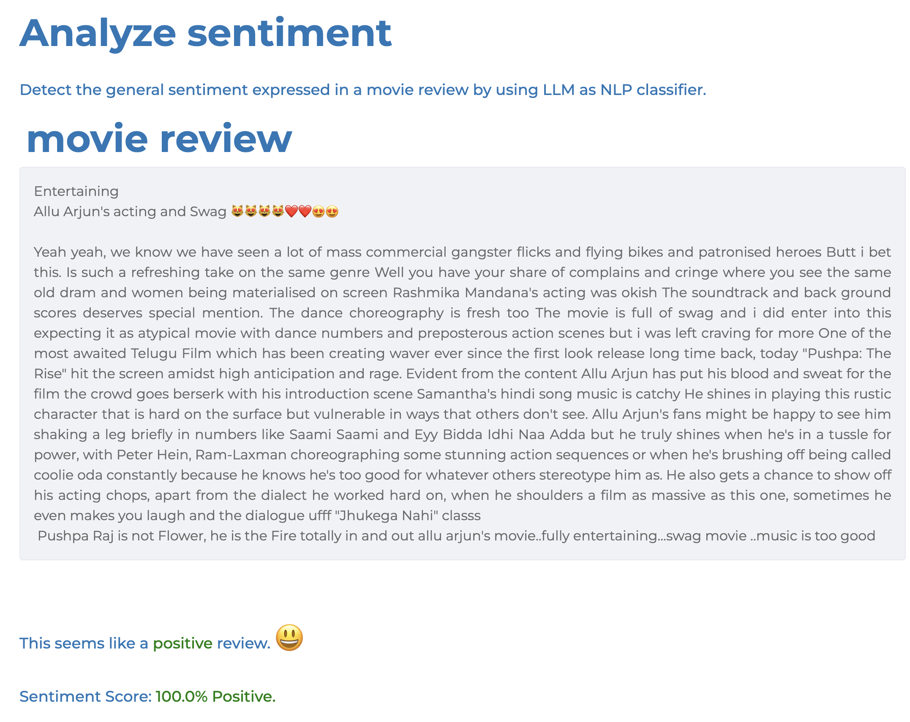
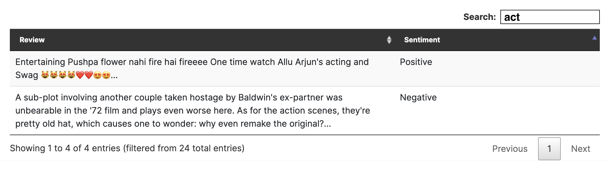

# Python Full Stack Assessment

## Objective
Develop a Python web application to detect the sentiment of movie reviews. The app should include a ReactJS-based frontend that calls a FastAPI Python backend, which utilizes cohere free LLM API for sentiment analysis.

## Tech Stack Requirements
- **GenAI:** Utilize any publicly available free LLM API. For example:
  Reference: https://cohere.com/blog/free-developer-tier-announcement https://dashboard.cohere.com/api-keys, https://docs.cohere.com/reference/classify 
  ```
        import cohere

        # Initialize the client with your API key
        co = cohere.Client('YOUR_API_KEY')

        # Sample movie review to classify
        review = "The movie was an absolute masterpiece with stunning visuals and a gripping storyline."

        # Call the classify endpoint
        response = co.classify(
            model='large',  # Using a pre-trained classification model
            inputs=[review],
            examples=[
                cohere.ClassifyExample("I absolutely loved this movie, it was fantastic!", "Positive"),
                cohere.ClassifyExample("The plot was dull and boring, I didn't enjoy it at all.", "Negative"),
                cohere.ClassifyExample("The movie was okay, but nothing special.", "Neutral"),
                cohere.ClassifyExample("Great acting and direction, but the pacing was off.", "Positive"),
                cohere.ClassifyExample("I hated the ending, it ruined the whole experience.", "Negative"),
                cohere.ClassifyExample("It was just average, nothing memorable.", "Neutral")
            ]
        )

        # Print the classification result
        print(f"Review: {review}")
        print(f"Predicted Sentiment: {response.classifications[0].prediction}")
  ```
- **Frontend:** ReactJS
- **Backend:** FastAPI (Python)
- **Containerization:** Both frontend and backend must be containerized (e.g., Docker)
- **Deployment:** Deploy on a bare-metal cloud VM (e.g., GCP Compute Engine, AWS EC2)
- **Authentication:** No AuthN/AuthZ required

## Deliverables
1. **GitHub Repository:** Complete running solution uploaded to your repository.
2. **README:** A concise document explaining:
   - Implementation approach
   - Steps to run/test the application, any credentials, ip, url etc
   - Additional setup instructions (if any)

## Guidelines
- **Environment Setup:** Ensure compatibility with the latest stable library versions. Follow best coding practices.
- **NO AI CODE:** Please don't submit copy pasted code from ChatGPT rather learn from AI and put as per best practice.

## Notes
> - Feel free to use any public cloud provider from AWS, GCP, or Azure.
> - Use a clean, modular architecture for your code.
> - Include proper code comments and documentation where necessary.

### App Architecture


### UI/UX Mockups
_(Feel free to deliver your own way of this UX but make sure sentiment analysis is available in your app.)_

1. **Sentiment Analysis** (UI-1)


1. **(OPTIONAL ONLY) List of Sentiment Analyzed** (UI-2)


# **Good Luck!**
